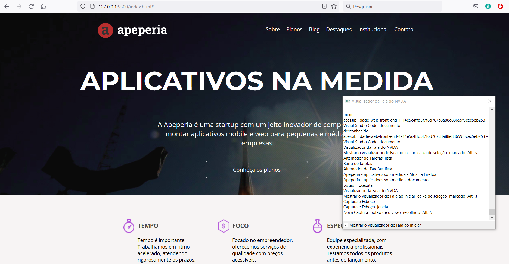

## Curso de Acessibilidade web parte 1: tornando seu front-end inclusivo

**Faça esse curso de HTML e CSS e:**

- Melhore seu site para usuários de leitor de tela;

- Entenda como uma pessoa cega usa a internet;

- Aprenda a testar seu site usando o NVDA;

- Perceba como detalhes no código podem impactar as pessoas;

- Faça técnicas front-end que podem ajudar seus usuários;

- Deixe seu projeto ainda mais inclusivo.

GitHub Pages
[Acessem](https://tiagomerc.github.io/Acessibilidade-web-parte-1-tornando-seu-front-end-inclusivo/)

### HTML e os leitores de tela

**Consolidando seu conhecimento**

Faça as modificações feitas em aula a fim de deixar o projeto inicial mais acessível tendo como foco o público cego e de baixa visão.

Lembre-se de pontos como:

- evitar mais de um "< H1 >" na página;

- usar HTML5 semântico que faça sentido;

- configurar o NVDA conforme visto em aula.

### 02. Atributos lang e alt

**Consolidando seu conhecimento**

Lembre-se de pontos como:

- alt nas imagens que possuem função de conteúdo;

- escrever o alt de maneira descritiva, evitando redundâncias;

- configurar o idioma principal do documento com o atributo lang;

- colocar o elemento <title> em SVGs que forem inline (código direto no HTML).

### 03. CSS interfere no leitor de tela? Listas e display: none

### 04. Um pouco sobre roles e arias

### 05. Formulário acessível

